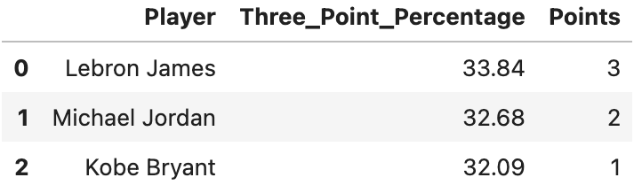
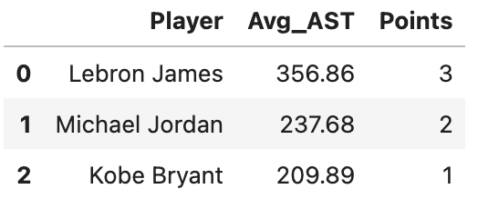

# The eternal question has an answer? Who is better?
- Michael Jordan (MJ)
- Kobe Bryant (KB)
- Lebron James (LJ)


Esta pregunta nos la llevamos haciendo los "nerds" del baloncesto durante muchos años y yo verdaderamente creía que lo tenia claro, no se si por mi avanzada edad o porque me crié con un baloncesto donde "dormir era de cobardes" ya que la única manera de ver NBA era aguantar hasta las 3 de la mañana sin que tus padres te pillarán, ya que al día siguiente había colegio, en fin... que tiempos aquellos. Bueno a lo que venía, hace unos días un señor llamado Shaquille O'neal, me reabrio el debate interno, y os preguntaréis porque? Pués bien este señor que ha sido uno grnadísimo jugador compañero de Kobe Bryant (DP) dijo en una entrevista, realizada por otro ex-NBA:

"He escuchado a jugadores decir, incluyéndome a mí, "Temía a Michael Jordan". He escuchado a jugadores de tú generación decir que temían a Kobe Bryant", dijo O'Neal.

Y acaba la frase diciendo: "Nunca escuché a ningún jugador decir que le temen a LeBron".

Lebron no tardó mucho en reaccionar!!!!


Pues después de poneros en contexto, no va a dejar de ser una tónica, cual es vuestra apuesta, quién creeis que es el mejor?

¡Vamos a averiguarlo!

Para obtener la respuesta a esta pregunta, he usado un database donde tenemos varias tablas, estas tablas encontramos los siguientes datos:

TOTALS STATS - ESTADÍSTICAS TOTALES
ALLGAMES STATS - ESTADÍSTICAS DE TODOS LOS JUEGOS
ALLSTAR GAMES STATS - ESTADÍSTICAS DE LOS JUEGOS ALLSTAR
GAME HIGHS STATS - ESTADÍSTICAS MÁXIMAS DEL JUEGO
ADVANCED STATS - ESTADÍSTICAS AVANZADAS
PER GAME STATS - ESTADÍSTICAS POR PARTIDO
SALARIES - SALARIOS

He tenido que crear una nueva tabla llamada player_name con los 3 nombre para que se mi primary key debido a que los valores tiene que ser únicos.

Posteriormente he definido la foreign key en la tabla totals_stats.

Para contestar la pregunta que me ha llevado a plantear este proyecto, he realizado una serie de consultas, donde en cada consulta he realizado un rankig del de 1 a 3, dónde el que ocupa la primera posición obtiene 3 puntos y el que ocupa la última posición obtiene 1 punto.

Cuestiones que he valorado para obtener la puntuación total:

## Teminología


TABLA 1

| Término | Significado | Término | Significado |
|---------|-------------|---------|-------------|
| Pos | Posición | eFG% | Porcentaje de Tiros de Campo Efectivos |
| Tm | Equipo | Tm | Equipo |
| G | Juegos | Lg | Liga |
| GS | Juegos Iniciados | +/- | Plus/Menos |
| MP | Minutos Jugados Por Juego | GmSc | Puntuación del Juego |
| FG | Tiros de Campo Por Juego | PTS | Puntos por Juego |
| FGA | Intentos de Tiros de Campo Por Juego | PF | Faltas Personales por Juego |
| FG% | Porcentaje de Tiros de Campo | TOV | Pérdidas de Balón por Juego |
| 3P | Tiros de Campo de 3 Puntos Por Juego | BLK | Bloqueos por Juego |
| 3PA | Intentos de Tiros de Campo de 3 Puntos Por Juego | STL | Robos por Juego |
| 3P% | Porcentaje de Tiros de Campo de 3 Puntos | AST | Asistencias por Juego |
| 2P | Tiros de Campo de 2 Puntos Por Juego | TRB | Rebotes Totales por Juego |
| 2PA | Intentos de Tiros de Campo de 2 Puntos Por Juego | DRB | Rebotes Defensivos por Juego |
| 2P% | Porcentaje de Tiros de Campo de 2 Puntos | ORB | Rebotes Ofensivos por Juego |
| FT | Tiros Libres Por Juego | FT% | Porcentaje de Tiros Libres |
| FTA | Intentos de Tiros Libres Por Juego | | |


TABLA 2

| Término | Significado | Explicación |
|---------|-------------|-------------|
| PER | Índice de Eficiencia del Jugador | Una medida de la producción por minuto estandarizada de manera que el promedio de la liga sea 15. |
| TS% | Porcentaje de Tiro Real | Una medida de eficiencia de tiro que tiene en cuenta los tiros de campo de 2 puntos, los tiros de campo de 3 puntos y los tiros libres. |
| 3PAr | Tasa de Intentos de Triple | Porcentaje de Intentos de Tiro de Campo desde la Línea de Triple. |
| FTr | Tasa de Intentos de Tiros Libres | Número de Intentos de Tiros Libres por Intento de Tiro de Campo. |
| ORB% | Porcentaje de Rebotes Ofensivos | Una estimación del porcentaje de rebotes ofensivos disponibles que un jugador agarró mientras estaba en la cancha. |
| DRB% | Porcentaje de Rebotes Defensivos | Una estimación del porcentaje de rebotes defensivos disponibles que un jugador agarró mientras estaba en la cancha. |
| TRB% | Porcentaje de Rebotes Totales | Una estimación del porcentaje de rebotes disponibles que un jugador agarró mientras estaba en la cancha. |
| AST% | Porcentaje de Asistencias | Una estimación del porcentaje de tiros de campo de compañeros de equipo que un jugador asistió mientras estaba en la cancha. |
| STL% | Porcentaje de Robos | Una estimación del porcentaje de posesiones del oponente que terminan con un robo por parte del jugador mientras estaba en la cancha. |
| BLK% | Porcentaje de Bloqueos | Una estimación del porcentaje de intentos de tiros de campo de dos puntos del oponente bloqueados por el jugador mientras estaba en la cancha. |
| TOV% | Porcentaje de Pérdidas de Balón | Una estimación de las pérdidas de balón cometidas por cada 100 jugadas. |
| USG% | Porcentaje de Uso | Una estimación del porcentaje de jugadas del equipo utilizadas por un jugador mientras estaba en la cancha. |
| OWS | Acciones de Victoria Ofensivas | Una estimación del número de victorias contribuidas por un jugador debido a su ofensiva. |
| DWS | Acciones de Victoria Defensivas | Una estimación del número de victorias contribuidas por un jugador debido a su defensa. |
| WS | Acciones de Victoria | Una estimación del número de victorias contribuidas por un jugador. |
| WS/48 | Acciones de Victoria por 48 Minutos | Una estimación del número de victorias contribuidas por un jugador por cada 48 minutos (el promedio de la liga es aproximadamente 0.100). |
| OBPM | Más/Menos Ofensivo en la Caja | Una estimación de la cantidad de puntos ofensivos por 100 posesiones que un jugador contribuyó por encima de un jugador promedio de la liga, traducido a un equipo promedio. |
| DBPM | Más/Menos Defensivo en la Caja | Una estimación de la cantidad de puntos defensivos por 100 posesiones que un jugador contribuyó por encima de un jugador promedio de la liga, traducido a un equipo promedio. |
| BPM | Más/Menos en la Caja | Una estimación de la cantidad de puntos por 100 posesiones que un jugador contribuyó por encima de un jugador promedio de la liga, traducido a un equipo promedio. |
| VORP | Valor sobre el Jugador de Reemplazo | Una estimación de la cantidad de puntos por 100 posesiones de EQUIPO que un jugador contribuyó por encima de un jugador de nivel de reemplazo (-2.0), traducido a un equipo promedio y prorrateado a una temporada de 82 juegos. |


## Primera consulta: Media de puntos anotados por cada jugador en la temporada regular y los playoffs en toda su carrera:

```sql
SELECT Player, Total_PTS,
    CASE 
        WHEN RANK() OVER (ORDER BY Total_PTS DESC) = 1 THEN 3
        WHEN RANK() OVER (ORDER BY Total_PTS DESC) = 2 THEN 2
        WHEN RANK() OVER (ORDER BY Total_PTS DESC) = 3 THEN 1
    END AS Points
FROM (
    SELECT Player, ROUND(AVG(PTS), 2) AS Total_PTS
    FROM totals_stats
    WHERE Player IN ('Michael Jordan', 'LeBron James', 'Kobe Bryant')
    GROUP BY Player
) AS player_stats
ORDER BY Total_PTS DES
```


## Segunda consulta: Porcentaje de tiros de campo anotados de cada jugador en la temporada regular y los playoffs:

```sql
SELECT Player, FG_Percentage,
    CASE 
        WHEN RANK() OVER (ORDER BY FG_Percentage DESC) = 1 THEN 3
        WHEN RANK() OVER (ORDER BY FG_Percentage DESC) = 2 THEN 2
        WHEN RANK() OVER (ORDER BY FG_Percentage DESC) = 3 THEN 1
    END AS Points
FROM (
    SELECT Player, ROUND(AVG(`FG%%`)*100, 2) AS FG_Percentage 
    FROM totals_stats
    WHERE Player IN ('Michael Jordan', 'LeBron James', 'Kobe Bryant') 
    GROUP BY Player
) AS player_stats
ORDER BY FG_Percentage DESC;
```


## Tercera consulta: Porcentaje de tiros de 3 puntos de cada jugador en la temporada regular y los playoffs:

```sql
SELECT Player, Three_Point_Percentage,
    CASE 
        WHEN RANK() OVER (ORDER BY Three_Point_Percentage DESC) = 1 THEN 3
        WHEN RANK() OVER (ORDER BY Three_Point_Percentage DESC) = 2 THEN 2
        WHEN RANK() OVER (ORDER BY Three_Point_Percentage DESC) = 3 THEN 1
    END AS Points
FROM (
    SELECT Player, ROUND(AVG(`3P%%`)*100, 2) AS Three_Point_Percentage
    FROM totals_stats
    WHERE Player IN ('Michael Jordan', 'LeBron James', 'Kobe Bryant')
    GROUP BY Player
) AS player_stats
ORDER BY Three_Point_Percentage DESC;
```




## Cuarta consulta: Media de asistencias por temporada de cada jugador en la temporada regular y los playoffs en toda su carrera:

```sql
SELECT Player, Avg_AST,
    CASE 
        WHEN RANK() OVER (ORDER BY Avg_AST DESC) = 1 THEN 3
        WHEN RANK() OVER (ORDER BY Avg_AST DESC) = 2 THEN 2
        WHEN RANK() OVER (ORDER BY Avg_AST DESC) = 3 THEN 1
    END AS Points
FROM (
    SELECT Player, ROUND(AVG(AST), 2) AS Avg_AST
    FROM totals_stats
    WHERE Player IN ('Michael Jordan', 'LeBron James', 'Kobe Bryant')
    GROUP BY Player
) AS player_stats
ORDER BY Avg_AST DESC;
```




## Quinta consulta: Promedio de robos por temporada de cada jugador en la temporada regular y playoff en toda su carrera:

```sql
SELECT Player, Avg_STL,
    CASE 
        WHEN RANK() OVER (ORDER BY Avg_STL DESC) = 1 THEN 3
        WHEN RANK() OVER (ORDER BY Avg_STL DESC) = 2 THEN 2
        WHEN RANK() OVER (ORDER BY Avg_STL DESC) = 3 THEN 1
    END AS Points
FROM (
    SELECT Player, ROUND(AVG(STL), 2) AS Avg_STL
    FROM totals_stats
    WHERE Player IN ('Michael Jordan', 'LeBron James', 'Kobe Bryant')
    GROUP BY Player
) AS player_stats
ORDER BY Avg_STL DESC;
```


## Sexta consulta: Promedio de rebote por temporada de cada jugador en la temporada regular y playoff en toda su carrera:

```sql
SELECT Player, Avg_TRB,
    CASE 
        WHEN RANK() OVER (ORDER BY Avg_TRB DESC) = 1 THEN 3
        WHEN RANK() OVER (ORDER BY Avg_TRB DESC) = 2 THEN 2
        WHEN RANK() OVER (ORDER BY Avg_TRB DESC) = 3 THEN 1
    END AS Points
FROM (
    SELECT Player, ROUND(AVG(TRB), 2) AS Avg_TRB
    FROM totals_stats
    WHERE Player IN ('Michael Jordan', 'LeBron James', 'Kobe Bryant')
    GROUP BY Player
) AS player_stats
ORDER BY Avg_TRB DESC;
```


## Septima consulta: Promedio de tapones por temporada de cada jugador en la temporada regular y playoff en toda su carrera:

```sql
SSELECT Player, Avg_BLK,
    CASE 
        WHEN RANK() OVER (ORDER BY Avg_BLK DESC) = 1 THEN 3
        WHEN RANK() OVER (ORDER BY Avg_BLK DESC) = 2 THEN 2
        WHEN RANK() OVER (ORDER BY Avg_BLK DESC) = 3 THEN 1
    END AS Points
FROM (
    SELECT Player, AVG(BLK) AS Avg_BLK
    FROM totals_stats
    WHERE Player IN ('Michael Jordan', 'LeBron James', 'Kobe Bryant')
    GROUP BY Player
) AS player_stats
ORDER BY Avg_BLK DESC;
```


## Octava consulta: Promedio de balones perdidos por temporada de cada jugador en la temporada regular y playoff en toda su carrera:

```sql
SELECT Player, Avg_TOV,
    CASE 
        WHEN RANK() OVER (ORDER BY Avg_TOV ASC) = 1 THEN 3
        WHEN RANK() OVER (ORDER BY Avg_TOV ASC) = 2 THEN 2
        WHEN RANK() OVER (ORDER BY Avg_TOV ASC) = 3 THEN 1
    END AS Points
FROM (
    SELECT Player, AVG(TOV) AS Avg_TOV
    FROM totals_stats
    WHERE Player IN ('Michael Jordan', 'LeBron James', 'Kobe Bryant')
    GROUP BY Player
) AS player_stats
ORDER BY Avg_TOV ASC;
```


## Novena consulta: Promedio del ratio de eficiencia cada jugador (PER) en la temporada regular y playoff en toda su carrera:

```sql
SELECT Player, Avg_PER,
    CASE 
        WHEN RANK() OVER (ORDER BY Avg_PER DESC) = 1 THEN 3
        WHEN RANK() OVER (ORDER BY Avg_PER DESC) = 2 THEN 2
        WHEN RANK() OVER (ORDER BY Avg_PER DESC) = 3 THEN 1
    END AS Points
FROM (
    SELECT Player, ROUND(AVG(PER), 2) AS Avg_PER
    FROM advanced_stats
    WHERE Player IN ('Michael Jordan', 'LeBron James', 'Kobe Bryant')
    GROUP BY Player
) AS player_stats
ORDER BY Avg_PER DESC;
```


## Decima consulta:  Promedio de BPM (Box Plus-Minus) por partido en la temporada regular y los playoffs:
### BPM: estadísticas acumuladas y porcentaje de tiempo jugado para estimar el impacto general de un jugador en el rendimiento de su equipo durante todo el tiempo que está en la cancha.

```sql
SELECT Player, Avg_BPM,
    CASE 
        WHEN RANK() OVER (ORDER BY Avg_BPM DESC) = 1 THEN 3
        WHEN RANK() OVER (ORDER BY Avg_BPM DESC) = 2 THEN 2
        WHEN RANK() OVER (ORDER BY Avg_BPM DESC) = 3 THEN 1
    END AS Points
FROM (
    SELECT Player, AVG(BPM) AS Avg_BPM
    FROM advanced_stats
    WHERE Player IN ('Michael Jordan', 'LeBron James', 'Kobe Bryant')
    GROUP BY Player
) AS player_stats;
```


## AND THE ANSWER IS...
```sql
-- Añadios los resultado en una tabla creada que la llamo, tabla de puntos

CREATE TABLE tabla_puntos (
    Player VARCHAR(255),
    Points INT
);

-- Primera consulta
INSERT INTO tabla_puntos (Player, Points) VALUES ('Michael Jordan', 3), ('LeBron James', 2), ('Kobe Bryant', 1);

-- Segunda consulta
INSERT INTO tabla_puntos (Player, Points) VALUES ('Michael Jordan', 2), ('LeBron James', 3), ('Kobe Bryant', 1);

-- Tercera consulta
INSERT INTO tabla_puntos (Player, Points) VALUES ('Michael Jordan', 2), ('LeBron James', 3), ('Kobe Bryant', 1);

-- Cuarta consulta
INSERT INTO tabla_puntos (Player, Points) VALUES ('Michael Jordan', 2), ('LeBron James', 3), ('Kobe Bryant', 1);

-- Quinta consulta
INSERT INTO tabla_puntos (Player, Points) VALUES ('Michael Jordan', 3), ('LeBron James', 2), ('Kobe Bryant', 1);

-- Sexta consulta
INSERT INTO tabla_puntos (Player, Points) VALUES ('Michael Jordan', 2), ('LeBron James', 3), ('Kobe Bryant', 1);

-- Septima consulta
INSERT INTO tabla_puntos (Player, Points) VALUES ('Michael Jordan', 2), ('LeBron James', 3), ('Kobe Bryant', 1);

-- Octava consulta
INSERT INTO tabla_puntos (Player, Points) VALUES ('Michael Jordan', 3), ('LeBron James', 1), ('Kobe Bryant', 2);

-- Novena consulta
INSERT INTO tabla_puntos (Player, Points) VALUES ('Michael Jordan', 2), ('LeBron James', 3), ('Kobe Bryant', 1);

-- Decima consulta
INSERT INTO tabla_puntos (Player, Points) VALUES ('Michael Jordan', 2), ('LeBron James', 3), ('Kobe Bryant', 1);

-- Mostramos el resultado en tabla

SELECT player, sum(points) AS Total_points FROM tabla_puntos
GROUP BY player
ORDER BY Total_points DESC;
```


### Pues si miramos las estadísticas, sí que parece que Lebron James da miedo, quizás los demás no lo digan porque realmente el miedo les paraliza y no son capaces de articular palabra! O simplemente que Shaquille es un bocazas!!!


# OTRAS CONSULTAS

## Promedio de minutos por juego (MP) de Lebron James en cada temporada separado por la Regular Season y por PlayOff:

```sql  
SELECT Season, Player,RSorPO,
    ROUND(AVG(MP) OVER(PARTITION BY Season), 2) AS AvgMPPerPosition
FROM per_game_stats
WHERE player = 'Lebron James'
ORDER BY player, season, RSorPO;
```


## Promedio de minutos por juego (MP) de Michael Jordan en cada temporada separado por la Regular Season y por PlayOff:

```sql
SELECT Season, Player,RSorPO,
    ROUND(AVG(MP) OVER(PARTITION BY Season), 2) AS AvgMPPerPosition
FROM per_game_stats
WHERE player = 'Michael Jordan'
ORDER BY player, season, RSorPO;
```


## Promedio de minutos por juego (MP) de Kobe Bryant en cada temporada separado por la Regular Season y por PlayOff:

```sql
SELECT Season, Player,RSorPO,
    ROUND(AVG(MP) OVER(PARTITION BY Season), 2) AS AvgMPPerPosition
FROM per_game_stats
WHERE player = 'Kobe Bryant'
ORDER BY player, season, RSorPO;
```


## Encontrar el jugador con el mejor rendimiento en términos de Efficiency (GmSc) en un partido:
### (GmSc) = (PTS + RB + AST + STL + BLK − FG Fallados − FT Fallados − PER)

```sql
SELECT ghs.Player, ghs.GmSc
FROM game_highs_stats AS ghs
JOIN (
    SELECT MAX(GmSc) AS max_GmSc
    FROM game_highs_stats
) AS max_ghs ON ghs.GmSc = max_ghs.max_GmSc
```

